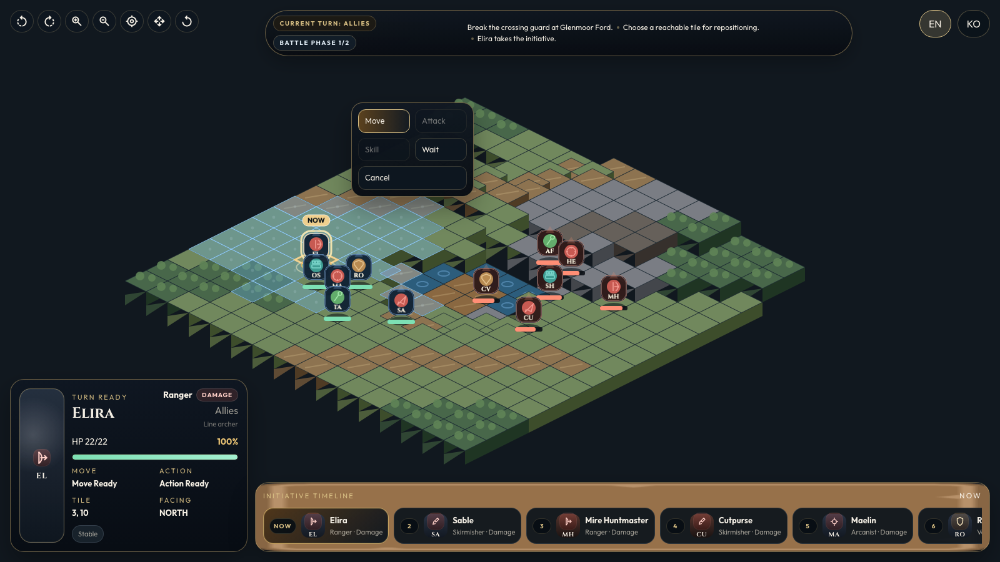

# Glenmoor Story

## Project overview

`Glenmoor Story` is a browser-first tactical RPG demo built with `Phaser 3`, `TypeScript`, and `Vite`.
It focuses on one authored SRPG battle instead of a full campaign: deterministic combat rules, an isometric battlefield, a separate duel scene for each exchange, a DOM HUD layered over the canvas, English source content, and Korean localization.

## Live demo

Play the latest deployed build here: <https://glenmoorstory.sqncs.com/>

## Feature highlights

- One handcrafted `16x16` isometric battle designed as a vertical slice
- Deterministic tactics runtime with initiative order, terrain, height, facing, status effects, counterattacks, and push effects
- Separate duel presentation for attacks and skills without desyncing map state
- Mouse-first HUD and battlefield controls with responsive layout support
- English and Korean localization for gameplay UI and wrapper copy
- Automated regression coverage for runtime logic, UI models, content loading, and browser QA flows

## Screenshot



## Quick start

```bash
npm install
npm run dev
```

Open the local Vite URL in your browser, or skip local setup and use the live demo above.

## Controls

- Click the active allied unit to open movement
- Click a reachable tile to reposition before committing an action
- Use `Attack`, `Skill`, `Wait`, or `Cancel` from the HUD command menu
- Rotate, zoom, recenter, and pan the battlefield from the HUD or mouse input
- Use the locale toggle to swap between English and Korean

## Scripts

- `npm run dev`: start the main game locally
- `npm run build`: type-check and build the production bundle
- `npm run preview`: preview the production build locally
- `npm test`: run the Vitest suite
- `npm run qa:playthrough`: run the scripted battle playthrough QA flow
- `npm run qa:camera`: run battlefield camera QA coverage
- `npm run qa:hud`: run HUD layout and target-preview QA coverage
- `npm run qa:mobile`: run responsive/mobile accessibility QA coverage
- `npm run asset-workbench:dev`: start the optional asset workbench workspace
- `npm run level-editor:dev`: start the Photoshop-style level editor workspace
- `npm run level-editor:build`: build the level editor workspace
- `npm run level-editor:test`: run the level editor helper tests

## Repo structure

- `src/`: game runtime, scenes, HUD, and data loading
- `public/`: map JSON and bundled placeholder assets
- `tests/`: Vitest coverage for core tactics and UI helpers
- `scripts/qa/`: browser QA scripts and automation helpers
- `docs/`: public documentation, architecture notes, QA inventory, asset attribution, and internal history
- `tools/asset-workbench/`: optional companion workspace for reviewing visual asset replacements
- `tools/level-editor/`: Photoshop-style level authoring workspace for maps, units, objectives, events, and playtest preview

## Docs

- [Documentation hub](docs/README.md)
- [Architecture overview](docs/architecture.md)
- [QA inventory](docs/qa-inventory.md)
- [Asset replacement and attribution manifest](docs/assets/asset-replacement-manifest.md)

## Level editor

The repository now includes a dedicated level editor workspace in [tools/level-editor](tools/level-editor/).

- The editor saves single-file level bundles to `public/data/levels/<slug>.level.json`
- The bundled `glenmoor-pass.level.json` file is the migrated seed battle for editing and sharing
- Inline playtest reuses the tactical runtime, and `Open Preview` / `Open Saved` can launch the main game runtime with the current bundle

The repository also keeps internal planning and progress notes for historical context:

- [Prototype plan](docs/plan.md)
- [Execution backlog](docs/backlog.md)
- [Progress log](docs/progress.md)
- [Agent handoff log](progress.md)

## Contributing

See [CONTRIBUTING.md](CONTRIBUTING.md) for setup, validation expectations, and workflow notes for gameplay, content, QA, and documentation changes.

## License / asset attribution

The code in this repository is released under the [MIT License](LICENSE).

Bundled third-party placeholder art and audio keep their own licenses and attribution requirements. See [docs/assets/asset-replacement-manifest.md](docs/assets/asset-replacement-manifest.md) for the current source and license record.
